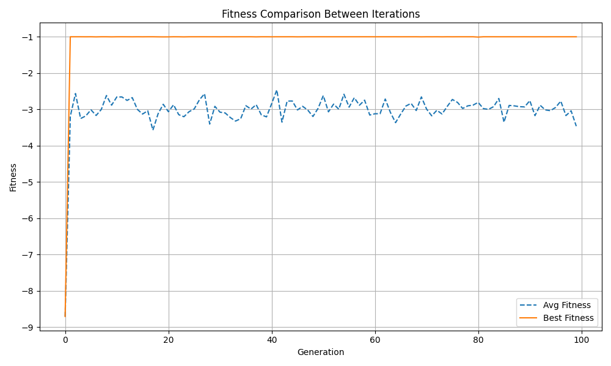

# NEAT-In-Python

## Overview
This repository implements the **NeuroEvolution of Augmenting Topologies (NEAT)** algorithm in Python. NEAT is a genetic algorithm designed to evolve artificial neural networks by optimizing both their connection weights and topologies over generations.

This implementation is based on the original paper by Kenneth O. Stanley, which is included in this repository as `stanley.ec02.pdf`.

## Features
- Custom activation functions
- Node and connection mutation
- Genetic crossover
- Phenotype expression of neural networks
- Sample neural network implementation

## Installation
Ensure you have Python installed on your system. Clone the repository and install dependencies (if any):

```sh
git clone https://github.com/RedFox-AI51/NEAT-In-python.git
cd NEAT-In-python
```

## File Structure
```
NEAT-In-python/
|── NEAT/
│──── Activations.py        # Defines activation functions
│──── Connection.py         # Manages network connections
│──── Crossover.py          # Handles genetic crossover
|──── InnovationTracker.py  # Makes sure that the connections are re-used instead of re-created
│──── Mutate.py             # Implements mutation operations
│──── Network.py            # Defines the neural network structure
|──── NEAT.py               # Is the simple class that brings the genome and the phenotype together
│──── Node.py               # Manages individual nodes (neurons)
│──── Phenotype.py          # Converts genotype into a working neural network
|── Tests/
│──── SampleNetwork.py      # Example usage of NEAT
│──── Phenotype_test.py     # Network Visualization example
│──── Crossover_Example.py  # Crossover example and testing
│──── NEAT_XOR_test.py      # XOR task with NEAT algorithm
│── stanley.ec02.pdf      # Original NEAT research paper
```

## Usage
There are 4 different tests that you can run.

### Tests
 - Simple implementation `SampleNetwork.py`
 - Phenotype visualization test `Phenotype_test.py`
 - Network crossover test `Crossover_Example.py`
 - XOR test with the NEAT algorithm `NEAT_XOR_test.py`

## Simple implementation with: `SampleNetwork.py`:
The `SampleNetwork.py` file is pretty simple to understand.

First it makes a new 'random" network.
Once the network has been made, it will show what the network looks like before it passes a random set of values into the network to test.

Once we test the network, we need to mutate it. We give it 10 mutations before visualizing the new network and testing it again with the same input values as the first one.

Heres how you can run it for yourself:
```sh
python SampleNetwork.py
```

## Phenotype testing with: `Phenotype_test.py`
Phenotype_test.py is a minimal test script used to visualize the structure of a neural network built using the NEAT framework.

This script creates a simple network with a mix of input, hidden, and output nodes. It uses randomized initial values and weights to demonstrate how nodes and connections are represented and processed. The core purpose is to test and visualize the phenotype — the expressed structure of the network based on its genotype (nodes + connections).

Heres how you can run it for yourself:
```sh
python Phenotype_test.py
```

## Network Crossovers with: `Crossover_example.py`
This one may be a bit harder to understand but it was even harder to implement.

Like the other tests, we make a random network but this time we make 2 networks instead of 1.
We give the networks a random fitness from -1 to 1 and the network that has the highest fitness will become the dominant and optimal network.

The Crossover process collects the Disjoint and Excess genes of the networks and with a bit of math, and maybe way too many lines of code, the Crossover process makes a new child with the 2 parents and returns it to us.

Finally at the end, it shows us all 3 networks. Parent 1, Parent 2 and the child

To run it for yourself:
```sh
python Crossover_Example.py
```

## Finally, The NEAT XOR problem with: `NEAT_XOR_test.py`
This took way too long so let me try to explain it the best I can.

First off, we should define the fitness function.

```python
# Fitness function for the XOR problem
def fitness_function(network: Network) -> float:
    inputs = [
        (0, 0),  # Expected output: 0       ───|
        (0, 1),  # Expected output: 1          |──── These are the inputs that are passed into the network
        (1, 0),  # Expected output: 1          |
        (1, 1)   # Expected output: 0       ───|
    ]
    expected_outputs = [0, 1, 1, 0]  #      ───|──── These are the expected outputs for the network
    fitness = 0.0

    for node in network.nodes:
        node.value = 0.0

    for i, (input_1, input_2) in enumerate(inputs):       # ────|
        network.nodes[0].value = input_1                  #     |
        network.nodes[1].value = input_2                  #     |──── This part tests the network with the XOR inputs
        network.run()                                     #     |
        output = network.get_output()[0]                  #     |
        fitness += (expected_outputs[i] - output) ** 2    # ────|

    return -fitness  # Negative because we want to minimize error
```

The Fitness function here will loop through the input truth table of the xor gate and the network is expected to predict the output of xor and continue the truth table.

All Networks start like this
```python
# Define the nodes in the preferred order: input, output, hidden
nodes = [
    Node(1, NodeType.INPUT, 0.0),   # Input node 1
    Node(2, NodeType.INPUT, 0.0),   # Input node 2
    Node(3, NodeType.OUTPUT, 0.0, ActivationFunctions.TanH),  # Output node
    Node(4, NodeType.HIDDEN, 0.0, ActivationFunctions.ReLu)   # Hidden node
]

# Define the connections (from inputs to hidden, hidden to output)
conns = [
    Connection(Innov=1, weight=0.5, from_node=nodes[0], to_node=nodes[3], enabled=True),  # Input 1 -> Hidden
    Connection(Innov=2, weight=0.5, from_node=nodes[1], to_node=nodes[3], enabled=True),  # Input 2 -> Hidden
    Connection(Innov=3, weight=0.8, from_node=nodes[3], to_node=nodes[2], enabled=True)   # Hidden -> Output
]
```

## NEAT XOR results:


Where they have 2 input nodes, 1 output node and 1 hidden node.
This is the default structure of the xor network and the NEAT algorithm will do its best to minimize its loss so it is more accurate.

## Future Improvements
- Add support for different evolutionary strategies
- Improve efficiency with parallel processing
- Implement visualization tools for evolved networks

## References
- [Original NEAT Paper by Kenneth O. Stanley](https://nn.cs.utexas.edu/downloads/papers/stanley.ec02.pdf)
- [Better NEAT Explination](https://macwha.medium.com/evolving-ais-using-a-neat-algorithm-2d154c623828)

## License
This project is open-source. Feel free to contribute or modify it as needed!

---

For any issues or contributions, please submit a pull request or open an issue on GitHub.
